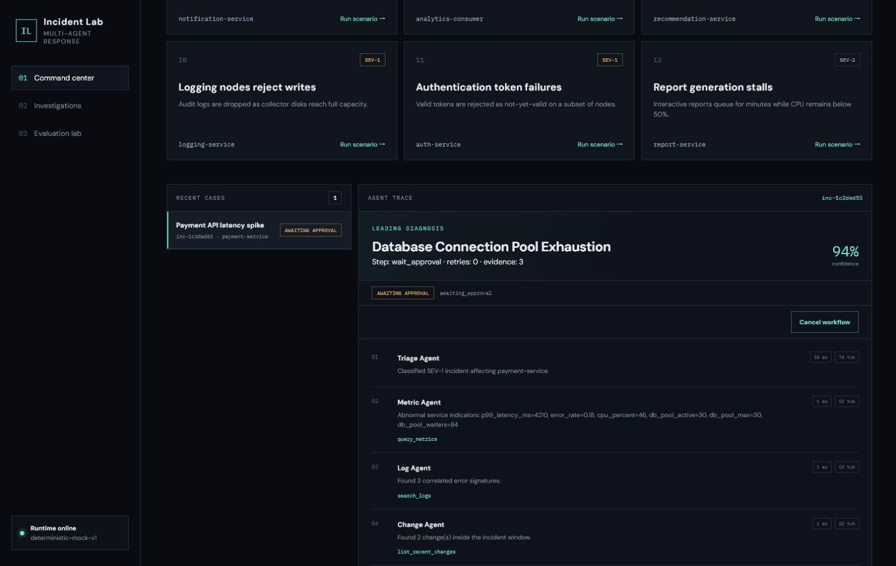
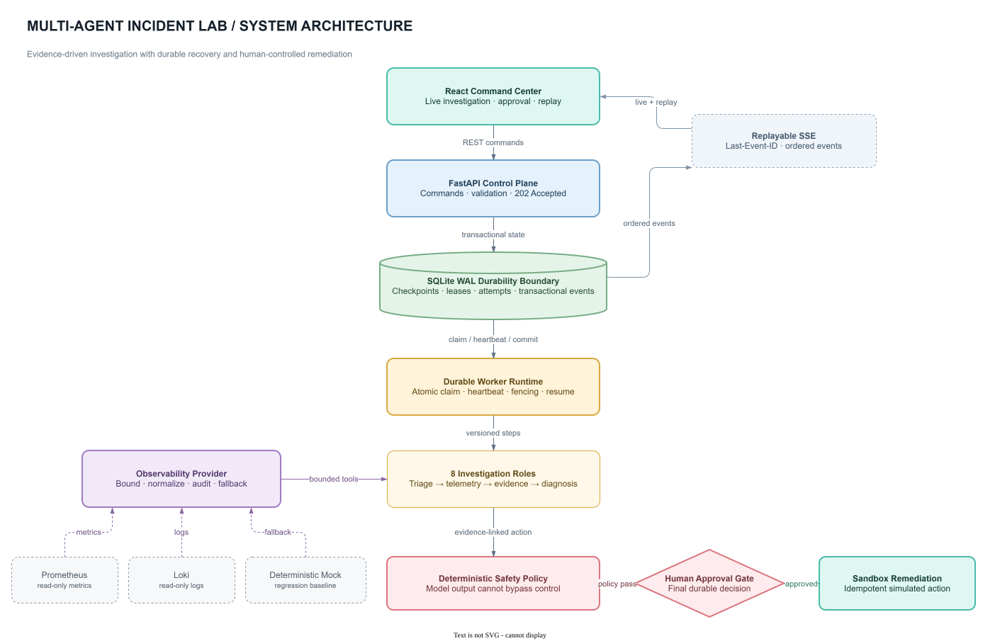
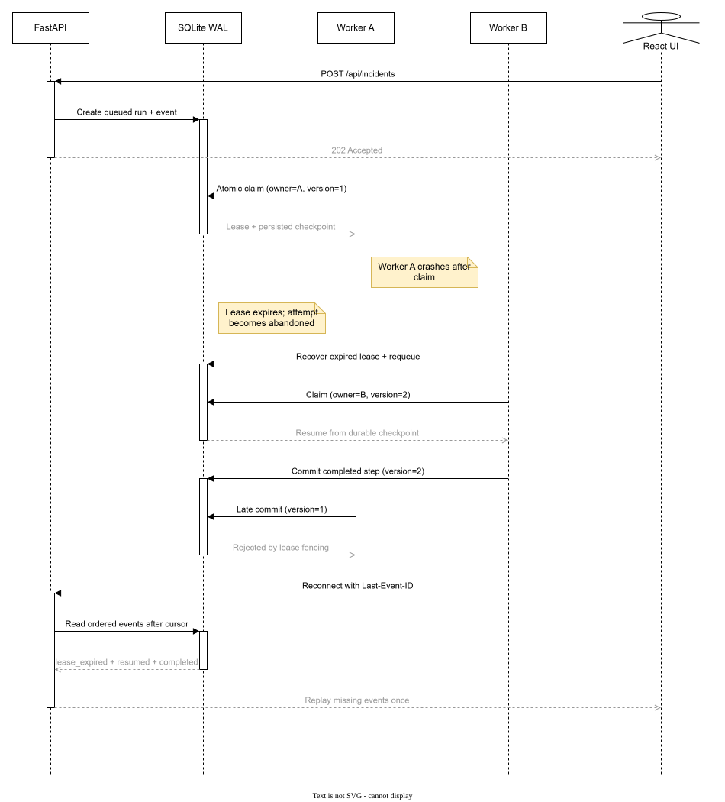

# Multi-Agent Incident Lab

**Evidence-driven multi-agent incident response with durable recovery and real observability adapters.**

[](https://github.com/kingslayer-ops/multi-agent-incident-lab/actions/workflows/ci.yml)
[](https://github.com/kingslayer-ops/multi-agent-incident-lab/releases/latest)

[](LICENSE)

[中文文档](README.zh-CN.md) · [Architecture](docs/architecture.md) · [Production runtime](docs/production-runtime.md) · [Workflow reliability](docs/workflow-reliability.md) · [Observability adapters](docs/observability-adapters.md) · [E2E testing](docs/e2e-testing.md) · [Security](SECURITY.md)

Multi-Agent Incident Lab is a full-stack incident investigation workbench. Eight specialized roles collect telemetry, correlate changes, build evidence-linked hypotheses, review risk, wait for human approval, execute a sandbox remediation, and verify recovery. The API and Workers are separate processes; every workflow step is checkpointed in SQLite WAL or PostgreSQL before execution continues.

> This repository is a safe laboratory. It never invokes operating-system, cloud, or Kubernetes commands.

## Product tour



The deterministic order-deadlock scenario is paused at its durable approval checkpoint in the Simplified Chinese console: the browser shows the evidence-linked root cause, confidence, immutable evidence count, Agent trace, and persisted workflow state. The same browser loop is covered by the repository's Playwright suite.

| Durable by design | Human-controlled | Observable and reproducible |
| --- | --- | --- |
| Lease claims, heartbeats, checkpoints, stale-worker fencing, retries, cancel, and resume | A final persisted approval is required before the idempotent sandbox remediation | Read-only Prometheus/Loki adapters fall back independently to a deterministic Mock baseline |

## Architecture



The API never waits for an investigation. The default profile uses SQLite `BEGIN IMMEDIATE`; the production profile uses PostgreSQL `FOR UPDATE SKIP LOCKED` and Redis wake-up hints. A Worker commits output only while it still owns the matching lease version. The diagram shows the default profile; see [production runtime](docs/production-runtime.md) for the multi-Worker deployment.

## Worker crash recovery



If a process dies, another Worker recovers the expired lease and resumes from the persisted step. A late commit from the stale owner is rejected by owner/version fencing, while `Last-Event-ID` lets the browser replay only missing events. See [workflow reliability](docs/workflow-reliability.md) for guarantees and non-goals; the editable diagram is [`worker-recovery-sequence.drawio`](docs/assets/worker-recovery-sequence.drawio).

## Highlights

| Area | Implementation |
| --- | --- |
| Durable workflow | API returns `202`; an independent Worker executes ten stable, versioned steps |
| Crash recovery | Atomic lease claims, heartbeats, attempt history, stale-worker fencing, retries, cancel, and resume |
| Delivery semantics | At-least-once scheduling with idempotent step commits and remediation keys—not exactly-once execution |
| Transactional events | State transitions and ordered SSE events commit in the same SQLite/PostgreSQL transaction |
| Multi-Worker runtime | PostgreSQL row-level claims plus Redis wake-up hints; database polling remains the lossless fallback |
| Human control | A final, durable approval record is required before any simulated mutating action |
| Evidence | Every hypothesis cites immutable metric, log, and change evidence IDs |
| Live telemetry | Read-only Prometheus and Loki range-query adapters with bounded queries and normalized evidence |
| Telemetry fallback | Timeout, rate-limit, protocol, and empty-result failures degrade independently to an auditable Mock baseline |
| Model fallback | OpenAI-compatible structured output degrades to deterministic offline diagnosis |
| Evaluation | 12 fault families measure diagnosis accuracy, evidence coverage, safety, and latency |
| Browser proof | Six Playwright flows cover refresh, approval/rejection, Worker restart, and SSE recovery |
| Delivery | React/TypeScript, FastAPI, Docker Compose, coverage gate, and GitHub Actions |

## Quick start

Requirements: Docker with Compose support.

```bash
docker compose up --build
```

Open <http://localhost:8000>; API documentation is at <http://localhost:8000/docs>. Compose starts separate `api` and `worker` services sharing the `incident-lab-data` volume. The default deterministic mode requires no external service or key.

To use an OpenAI-compatible model, copy `.env.example`, set `INCIDENT_LAB_LLM_MODE=openai-compatible`, and configure its endpoint, model, and key. Model failures are recorded and fall back without bypassing policy.

To query real observability data, set `INCIDENT_LAB_TELEMETRY_MODE=live` and configure Prometheus and Loki endpoints. Mock telemetry remains the default for evaluation and E2E. Live failures can fall back independently with a machine-readable reason code. See [real observability adapters](docs/observability-adapters.md).

```dotenv
INCIDENT_LAB_TELEMETRY_MODE=live
INCIDENT_LAB_PROMETHEUS_URL=https://prometheus.example.com
INCIDENT_LAB_LOKI_URL=https://loki.example.com
```

For the PostgreSQL/Redis multi-Worker profile:

```bash
docker compose -f docker-compose.production.yml up --build --scale worker=2
```

PostgreSQL is the durable source of truth; Redis only reduces wake-up latency and can fail without losing queued work. See [production runtime](docs/production-runtime.md).

## Local development

Backend (Python 3.11+), using two terminals after installation:

```bash
python -m venv .venv
source .venv/bin/activate  # Windows: .venv\Scripts\activate
pip install -e ".[dev]"
uvicorn incident_lab.api:app --app-dir src --reload
```

```bash
python -m incident_lab.worker
```

Frontend (Node.js 20+):

```bash
cd frontend
npm ci
npm run dev
```

## Workflow states

`queued → running → retry_scheduled → running` supports transient recovery. The workflow can pause at `waiting_approval`, continue through `resuming`, and terminate as `resolved`, `failed`, or `cancelled`. A running cancellation first becomes `cancel_requested` and stops at the next safe commit boundary.

## API

| Method | Endpoint | Purpose |
| --- | --- | --- |
| `POST` | `/api/incidents` | Persist a queued workflow and return `202` |
| `GET` | `/api/incidents/{id}` | Read the latest durable incident checkpoint |
| `GET` | `/api/incidents/{id}/workflow` | Inspect run and step metadata |
| `GET` | `/api/incidents/{id}/events` | Replay SSE events with an event cursor |
| `POST` | `/api/incidents/{id}/approve` | Persist final approval and resume |
| `POST` | `/api/incidents/{id}/reject` | Persist rejection reason and cancel safely |
| `POST` | `/api/incidents/{id}/cancel` | Cancel now or request cancellation at a safe boundary |
| `POST` | `/api/incidents/{id}/retry` | Retry the failed step within the manual limit |
| `GET` | `/api/incidents/{id}/postmortem` | Export the post-incident report |
| `POST` | `/api/evaluations/run` | Run the deterministic 12-scenario benchmark |

```bash
curl -i -X POST http://localhost:8000/api/incidents \
  -H "Content-Type: application/json" \
  -d '{"scenario_id":"payment-pool-exhaustion"}'
```

## Verification

```bash
pytest --cov=incident_lab --cov-report=term-missing --cov-fail-under=90
cd frontend && npm run build
docker compose config
docker compose -f docker-compose.production.yml config
docker compose build
make e2e
```

Tests include atomic multi-worker claiming, retry and manual recovery, concurrent approval, transaction rollback, stale-worker fencing, ordered SSE replay, action idempotency, subprocess crash recovery, and Prometheus/Loki HTTP contract coverage. The isolated Playwright stack proves the browser loop, refresh recovery, approval pause/rejection, Worker restart, and SSE disconnect replay. Failure runs retain screenshots, video, Trace, browser/network logs, and Compose logs.

## Scope

This is a portfolio-grade incident-response laboratory, not a production distributed control plane. v1.4.0 adds an optional PostgreSQL/Redis multi-Worker runtime while preserving SQLite and Mock providers as the reproducible baseline. Sandboxed remediation and the absence of application authentication, multi-tenancy, and remote command execution remain explicit boundaries.

## License

[MIT](LICENSE)
