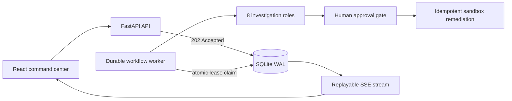

# Multi-Agent Incident Lab

**Evidence-driven multi-agent incident response with a durable, crash-recoverable workflow.**

[中文文档](README.zh-CN.md) · [Architecture](docs/architecture.md) · [Workflow reliability](docs/workflow-reliability.md) · [E2E testing](docs/e2e-testing.md) · [Security](SECURITY.md)

Multi-Agent Incident Lab is a full-stack incident investigation workbench. Eight specialized roles collect telemetry, correlate changes, build evidence-linked hypotheses, review risk, wait for human approval, execute a sandbox remediation, and verify recovery. The API and worker are separate processes, and every workflow step is checkpointed in SQLite WAL before execution continues.

> This repository is a safe simulation. It never invokes operating-system, cloud, or Kubernetes commands.

## Highlights

| Area | Implementation |
| --- | --- |
| Durable workflow | API returns `202`; an independent worker executes ten stable, versioned steps |
| Crash recovery | Atomic lease claims, heartbeats, attempt history, stale-worker fencing, retries, cancel, and resume |
| Delivery semantics | At-least-once scheduling with idempotent step commits and remediation keys—not exactly-once execution |
| Transactional events | State transitions and ordered SSE events commit in the same SQLite transaction |
| Human control | A final, durable approval record is required before any simulated mutating action |
| Evidence | Every hypothesis cites immutable metric, log, and change evidence IDs |
| Model fallback | OpenAI-compatible structured output degrades to deterministic offline diagnosis |
| Evaluation | 12 fault families measure diagnosis accuracy, evidence coverage, safety, and latency |
| Delivery | React/TypeScript, FastAPI, two-service Docker Compose, coverage gate, and GitHub Actions |
| Browser proof | Six Playwright flows cover refresh, approval/rejection, Worker restart, and SSE recovery |

## Architecture



The API never waits for an investigation. A worker claims one runnable step with `BEGIN IMMEDIATE`, records its attempt and event, then commits output only while it still owns the matching lease version. If the process dies, another worker recovers the expired lease and resumes from the persisted step. See [workflow reliability](docs/workflow-reliability.md) for guarantees and non-goals.

## Quick start

Requirements: Docker with Compose support.

```bash
docker compose up --build
```

Open <http://localhost:8000>; API documentation is at <http://localhost:8000/docs>. Compose starts separate `api` and `worker` services sharing the `incident-lab-data` volume. The default deterministic mode requires no key.

To use an OpenAI-compatible endpoint, copy `.env.example`, set `INCIDENT_LAB_LLM_MODE=openai-compatible`, and configure the endpoint, model, and key. Provider failures are recorded and fall back without bypassing policy.

## Local development

Backend (Python 3.11+), using two terminals after installation:

```bash
python -m venv .venv
source .venv/bin/activate  # Windows: .venv\Scripts\activate
pip install -e ".[dev]"
uvicorn incident_lab.api:app --app-dir src --reload
```

```bash
python -m incident_lab.worker
```

Frontend (Node.js 20+):

```bash
cd frontend
npm ci
npm run dev
```

## Workflow states

`queued → running → retry_scheduled → running` supports transient recovery. The workflow can pause at `waiting_approval`, continue through `resuming`, and terminate as `resolved`, `failed`, or `cancelled`. A running cancellation first becomes `cancel_requested` and stops at the next safe commit boundary.

## API

| Method | Endpoint | Purpose |
| --- | --- | --- |
| `POST` | `/api/incidents` | Persist a queued workflow and return `202` |
| `GET` | `/api/incidents/{id}` | Read the latest durable incident checkpoint |
| `GET` | `/api/incidents/{id}/workflow` | Inspect run and step metadata |
| `GET` | `/api/incidents/{id}/events` | Replay SSE events; supports `Last-Event-ID` |
| `POST` | `/api/incidents/{id}/approve` | Persist the final approval and resume |
| `POST` | `/api/incidents/{id}/cancel` | Cancel now or request cancellation at a safe boundary |
| `POST` | `/api/incidents/{id}/retry` | Retry the failed step within the manual limit |
| `GET` | `/api/incidents/{id}/postmortem` | Export the post-incident report |
| `POST` | `/api/evaluations/run` | Run the 12-scenario deterministic benchmark |

```bash
curl -i -X POST http://localhost:8000/api/incidents \
  -H "Content-Type: application/json" \
  -d '{"scenario_id":"payment-pool-exhaustion"}'
```

## Verification

```bash
pytest --cov=incident_lab --cov-report=term-missing --cov-fail-under=90
cd frontend && npm run build
docker compose config
docker compose build
make e2e
```

Tests include atomic multi-worker claiming, retry and manual recovery, concurrent approval, transaction rollback, stale-worker fencing, ordered SSE replay, action idempotency, and a real subprocess crash after lease acquisition. The isolated Playwright stack adds browser-level proof of the full incident loop, refresh recovery, approval pause/rejection, Worker restart, and SSE disconnect replay. Failure runs retain screenshots, video, trace, browser/network logs, and Compose logs. See [E2E testing](docs/e2e-testing.md).

## Scope

This is a portfolio-grade incident-response simulation, not a production distributed control plane. SQLite is intentionally retained for v1.2.x; real Prometheus/Loki adapters, Redis/PostgreSQL coordination, and remote command execution are outside this release.

## License

[MIT](LICENSE)
