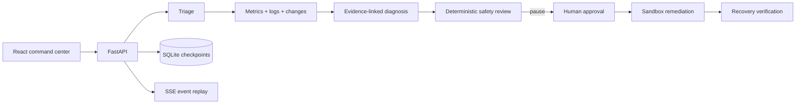

# OpsPilot

**Evidence-driven multi-agent incident response with durable checkpoints, human approval, and reproducible evaluation.**

[中文文档](README.zh-CN.md) · [Architecture](docs/architecture.md) · [Security](SECURITY.md) · [Contributing](CONTRIBUTING.md)

OpsPilot is a full-stack incident investigation workbench. Eight specialized roles collect telemetry, correlate changes, build evidence-linked hypotheses, review risk, request human approval, execute a sandbox remediation, and verify recovery. The complete workflow runs offline with deterministic intelligence, or against an OpenAI-compatible model with automatic fallback.

> OpsPilot is a safe simulation. It never invokes operating-system, cloud, or Kubernetes commands.

## Why it is different

Most agent demos expose only a final answer. Production incident response also needs provenance, resumable state, bounded tools, approval gates, degradation behavior, and measurable reliability. OpsPilot makes those properties visible and testable.

## Highlights

| Area | Implementation |
| --- | --- |
| Agent workflow | Triage, metrics, logs, changes, diagnosis, safety, remediation, and verification |
| Evidence | Every hypothesis cites immutable metric, log, and change evidence IDs |
| Durable state | SQLite WAL checkpoints survive API restarts; an in-memory adapter keeps tests isolated |
| Model fallback | OpenAI-compatible structured output with timeout/error fallback to deterministic diagnosis |
| Human control | Mutating actions remain blocked until explicit approval; execution is sandbox-only |
| Observability | Ordered trace with agent, tool, evidence, latency, token estimate, cost, and fallback events |
| Event stream | SSE replay endpoint for agent steps and incident state |
| Evaluation | 12 fault families measuring diagnosis accuracy, evidence coverage, unsafe actions, and latency |
| Delivery | React/TypeScript UI, FastAPI, Docker Compose, 90% coverage gate, and GitHub Actions |

## Workflow



## Quick start

Requirements: Docker with Compose support.

```bash
docker compose up --build
```

Open <http://localhost:8000>. API documentation is at <http://localhost:8000/docs>. Runtime data is kept in the named `opspilot-data` volume.

The default `mock` mode requires no API key. To use an OpenAI-compatible endpoint, copy `.env.example`, set `OPSPILOT_LLM_MODE=openai-compatible`, configure the endpoint/model/key, and pass the environment file to Compose. Any timeout, connection error, or invalid structured result is recorded and falls back to the offline provider.

## Local development

Backend (Python 3.11+):

```bash
python -m venv .venv
source .venv/bin/activate  # Windows: .venv\Scripts\activate
pip install -e ".[dev]"
uvicorn opspilot.api:app --app-dir src --reload
```

Frontend (Node.js 20+):

```bash
cd frontend
npm ci
npm run dev
```

The Vite development server proxies `/api` and `/health` to port `8000`.

## Fault library

The deterministic benchmark covers 12 families: database pool exhaustion, memory leaks, feature-flag regressions, TLS expiry, stale Redis topology, database deadlocks, provider rate limits, incompatible event schemas, service-discovery DNS failure, disk exhaustion, clock skew, and worker-pool saturation.

Ground-truth causes are held by the evaluation layer and are not passed to the intelligence provider. The offline provider diagnoses from telemetry signatures, which prevents answer leakage while keeping CI reproducible.

## API

| Method | Endpoint | Purpose |
| --- | --- | --- |
| `GET` | `/health` | Runtime health and active provider chain |
| `GET` | `/api/scenarios` | List controlled fault scenarios |
| `POST` | `/api/incidents` | Start and checkpoint an investigation |
| `GET` | `/api/incidents/{id}` | Read evidence, hypotheses, approval state, and trace |
| `GET` | `/api/incidents/{id}/events` | Replay ordered trace events as SSE |
| `POST` | `/api/incidents/{id}/approve` | Approve and execute one sandbox action |
| `GET` | `/api/incidents/{id}/postmortem` | Export the post-incident report |
| `POST` | `/api/evaluations/run` | Run the 12-scenario regression benchmark |
| `GET` | `/api/dashboard` | Read command-center summary metrics |

Example:

```bash
curl -X POST http://localhost:8000/api/incidents \
  -H "Content-Type: application/json" \
  -d '{"scenario_id":"payment-pool-exhaustion"}'
```

## Verification

```bash
pytest --cov=opspilot --cov-report=term-missing --cov-fail-under=90
cd frontend && npm run build
docker compose build
```

The test suite checks the investigation and approval lifecycle, unsafe-action prevention, all 12 diagnoses, HTTP contracts, SSE replay, model fallback, structured model parsing, and persistence after reopening the database.

## Repository layout

```text
opspilot/
├── src/opspilot/       # API, workflow, providers, policies, persistence, tools
├── tests/              # Unit and HTTP integration tests
├── frontend/           # React + TypeScript command center
├── docs/               # Architecture decisions
├── .github/workflows/  # CI quality gates
├── Dockerfile
└── docker-compose.yml
```

## Security and scope

The executor accepts only the `opspilot` simulation command namespace and never starts a shell. Model output cannot approve actions or change policy. Read [SECURITY.md](SECURITY.md) before connecting external telemetry, and report vulnerabilities with a private GitHub security advisory.

## License

[MIT](LICENSE)
