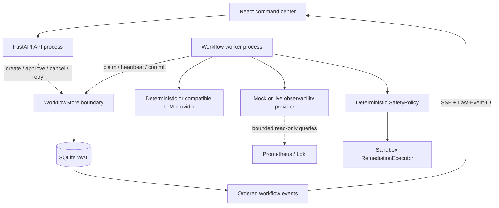
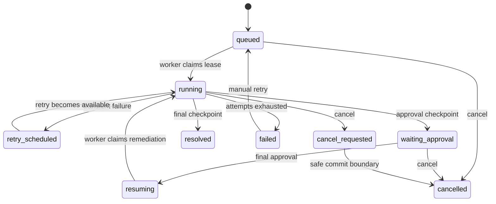

# Architecture

Multi-Agent Incident Lab separates request handling, durable orchestration, model reasoning, deterministic policy, and sandbox execution.

## Process boundaries

- The API validates requests and commits commands. Incident creation returns `202` after creating a run, its first queued step, and a `run.created` event in one transaction.
- The worker is the only component that executes investigation steps. Multiple workers may compete safely for work.
- `ObservabilityProvider` keeps the Agent tool contract stable. Mock telemetry is deterministic; live adapters normalize bounded Prometheus and Loki range queries and can fall back independently with an auditable reason code.
- `WorkflowStore` owns scheduling and persistence semantics. Its interface is deliberately narrow enough to replace SQLite with PostgreSQL or a Redis-backed queue later.
- `SQLiteStore` remains the typed incident/evaluation reader. Both stores share the same database and WAL journal.

## Versioned workflow

Each run records `workflow_name`, `workflow_version`, `schema_version`, and `engine_version`. v1.2 has ten stable step keys:

1. `triage`
2. `collect_metrics`
3. `collect_logs`
4. `inspect_changes`
5. `form_hypotheses`
6. `safety_review`
7. `wait_approval`
8. `execute_remediation`
9. `verify_recovery`
10. `generate_postmortem`

These are durable workflow steps, not ten new agents. The existing eight investigation roles remain unchanged.

## State machine

## Safety and reasoning

`IntelligenceProvider` is replaceable and may fail over to deterministic diagnosis. `ObservabilityProvider` is independently replaceable and never receives remediation capability. `SafetyPolicy` and approval records do not depend on model output. `RemediationExecutor` accepts only the `incident-lab` simulation namespace and never invokes a system shell.

See [workflow reliability](workflow-reliability.md) for lease fencing, transactional events, recovery behavior, and guarantees.
