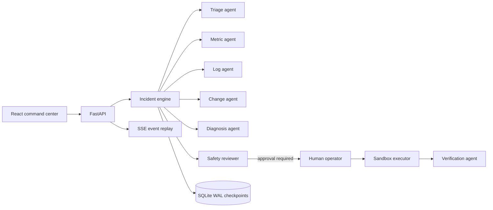
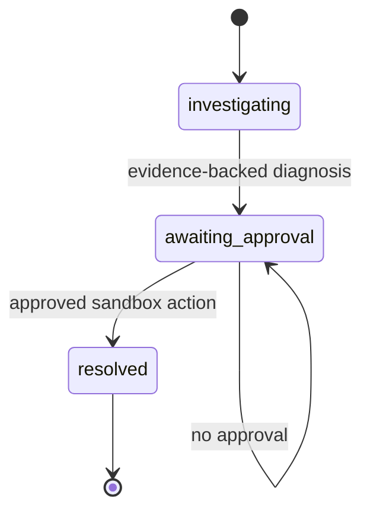

# Architecture

Multi-Agent Incident Lab separates deterministic safety and tool execution from model-driven reasoning. The demo provider is deterministic, which makes the repository runnable without credentials and keeps the evaluation suite reproducible.

## Core boundaries

- `IncidentEngine` owns workflow state and guarantees the investigation order.
- `ScenarioToolbox` exposes an explicit read-only tool allow-list.
- `IntelligenceProvider` makes model reasoning replaceable. The default implementation is deterministic.
- `SafetyPolicy` is independent from the provider. A model cannot approve its own mutating action.
- `RemediationExecutor` accepts only `incident-lab` sandbox commands and never invokes a system shell.
- Every hypothesis points to evidence IDs so conclusions can be audited.
- `SQLiteStore` persists JSON checkpoints with WAL journaling; `InMemoryStore` isolates tests.
- `FallbackProvider` records degradation when the OpenAI-compatible provider times out or violates the response schema.

## Workflow states

## Model modes

`mock` mode performs deterministic inference from telemetry signatures and never receives evaluation ground truth. `openai-compatible` mode requests JSON containing a root cause, confidence, and rationale. Invalid output and transport failures degrade to mock mode without bypassing policy. Tool execution and approval policy never depend on the provider.

## Recovery semantics

The engine checkpoints an incident after investigation and again after approval/execution. Reopening `SQLiteStore` reconstructs typed state including evidence, approval, trace order, and postmortem. WAL journaling supports concurrent reads, and the Docker named volume preserves checkpoints across container replacement.
